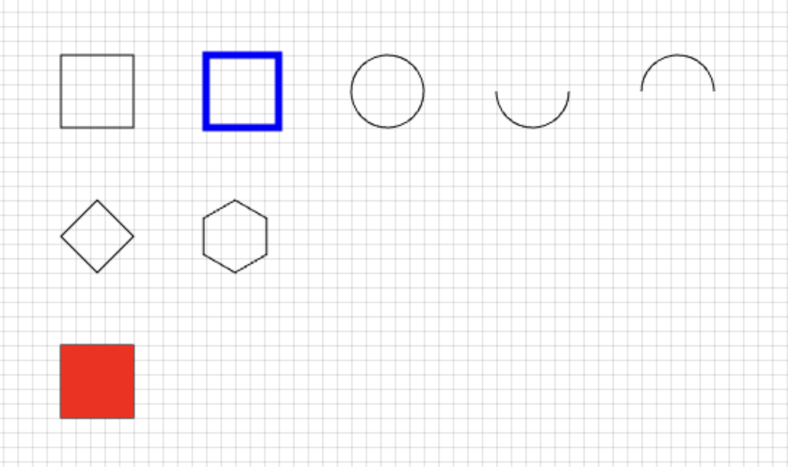

## Overview

Canvas library.

## Installation

```
npm install plain-canvas
```

## Usage

```js
// CommonJS
const Canvas = require('plain-canvas')
```

```js
// ESModule
import Canvas from 'plain-canvas'
```

```html
<!-- Script -->
<script src="../dist/plain-canvas.min.js"></script>
```

```js
const canvas = new Canvas(
  // canvas element
  document.querySelector('#canvas'),
  // default config
  {
    lineWidth: 1,
    fillStyle: 'white',
    strokeStyle: 'black'
  }
)

// grid
canvas.grid(10, 10, { strokeStyle: '#ccc', lineWidth: 0.5 })

// stroke
canvas.rect(50, 50, 50, 50)
canvas.rect(150, 50, 50, 50, { lineWidth: 5, strokeStyle: 'blue' })
canvas.circle(275, 75, 25)
canvas.arc(375, 75, 25, 0, Math.PI)
canvas.arc(475, 75, 25, 0, Math.PI, true)
canvas.polygon(75, 175, 25, 4)
canvas.polygon(170, 175, 25, 6)

// fill
canvas.rect(50, 250, 50, 50).fill('red')
```



## License

MIT
